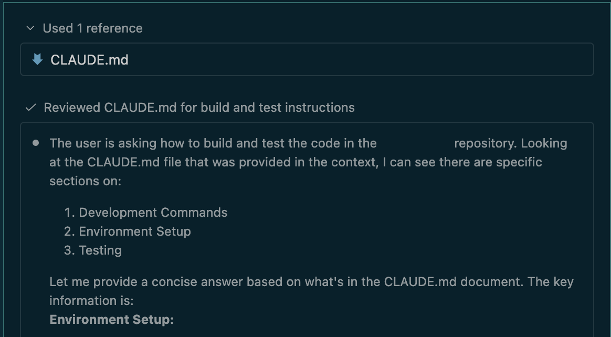

A while back I was exploring an open source project I was using, and interested in contributing to, as it provided capabilities I needed but missed some additional ones I wanted to have. Naturally, I was looking for a `CONTRIBUTING.md`. The file existed, but it only contained a note, that issues and PRs are accepted. While this is key information that belongs in this file, I was missing instructions on how to set up the repository, how to run tests, and what criteria I need to meet to increase my chances of having a PR accepted.

As developers often do, I opened my IDE and asked the LLM to help me with that: _How do I build and test this project_?

The LLM didn't need to crawl the code and figure things out because it automatically pulled agent-specific instructions from `CLAUDE.md`, which held the answer I was looking for. After inspection, the file also had all the details on PR acceptance criteria, which is another piece of information I was missing.

The repository was prepared to serve LLMs, but it didn't do the same for humans. This is a common pattern you see emerging at a lot of places right now, and the reason is that the return on investment for an [`AGENTS.md`](https://agents.md/) (or `CLAUDE.md`) is immediate compared to providing a dedicated file for humans like `HUMANS.md`. What I mean by that: if I, as a developer of an open source application, use an LLM, I can improve its work instantly by providing such instruction files. In contrast, the instructions I provide for humans in any form may never be picked up, or only after the project has gained traction.

The good news is, that this is an easy problem to fix, since many of the instructions we provide to an LLM are equally valuable to potential human contributors. So, instead of providing a file for agents and a file for humans, you can provide one file for both and then reference it from the `AGENTS.md`. And the better news is, there is no need for `HUMANS.md`, this file exists already, it's called [`CONTRIBUTING.md`](https://docs.github.com/en/communities/setting-up-your-project-for-healthy-contributions/setting-guidelines-for-repository-contributors)!

So, next time you revisit your `AGENTS.md` or start a new project, why not have instructions for both humans and agents alike in `CONTRIBUTING.md` and reference it from `AGENTS.md` or copy between them?

I'll try to follow my own advice! :-)