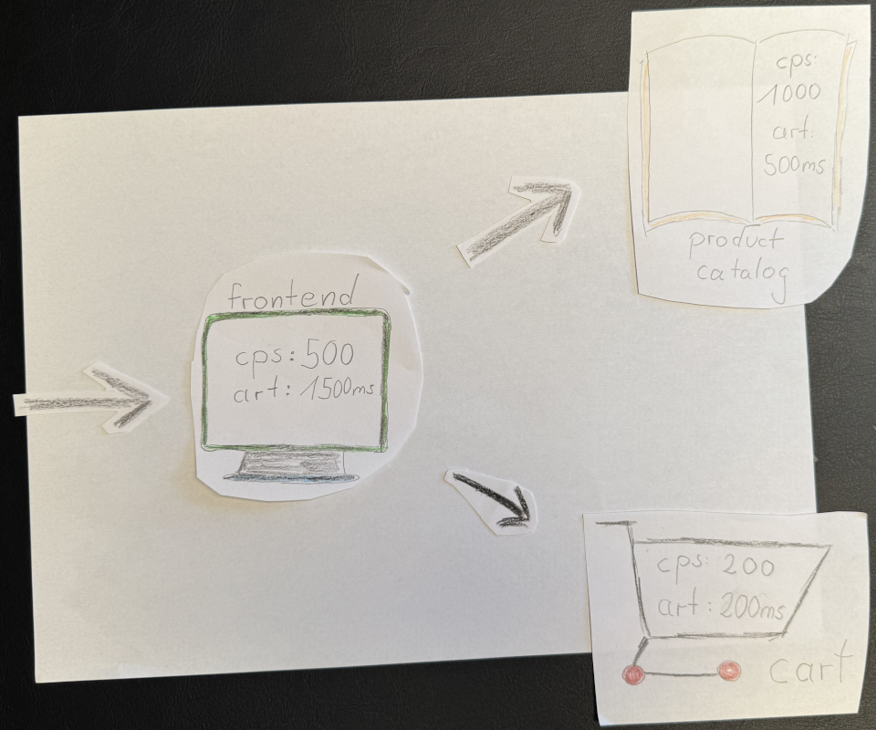
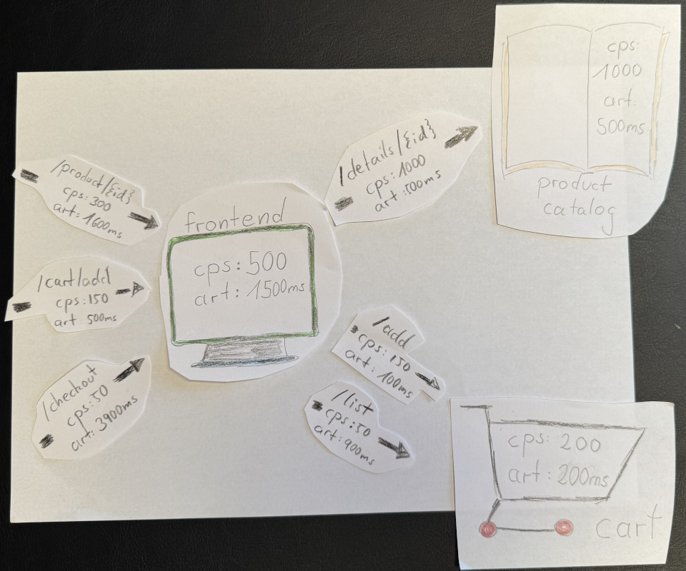
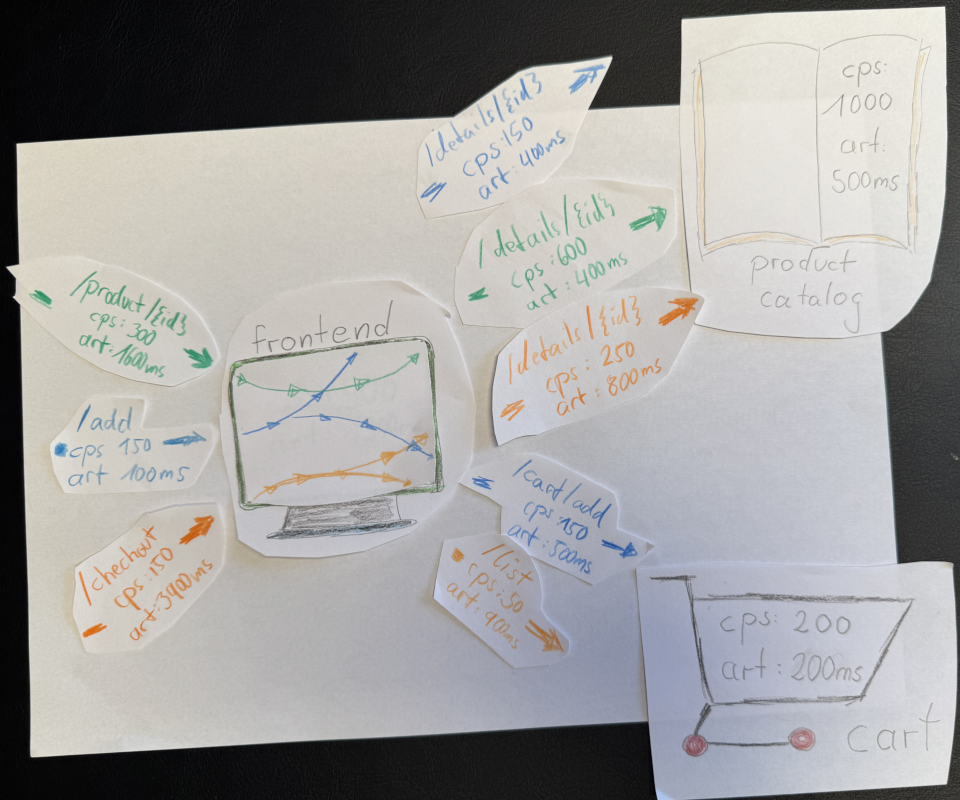

When you’re heads-down in your own area of expertise, it’s easy to forget that what’s obvious to you might not be to others. As you might have seen in previous posts, I learned that for me using pen and paper from time to time helps uncover unknown knowns in my head. Last time, it was [why the three pillars need to go](../thank-you-three-pillars-of-observability-you-served-us-well/). This time, it’s context propagation, and its surprising relationship to metrics.

Context propagation is often explained in the context of tracing: it’s the mechanism that carries metadata through every hop of a distributed request, allowing you to see a single transaction’s path across multiple services. But when I started sketching things out for myself, I realized that we rarely explain how context propagation gives you better metrics as well. So let me change that with three images.

Image 1 starts with a basic setup with three services: frontend, product catalog, and cart. Each has metrics like calls per second (CPS) and average response time (ART). Everything looks fine:

- Frontend: 500 CPS, 1500 ms ART
- Product catalog: 1000 CPS, 500 ms ART
- Cart: 200 CPS, 200 ms ART

Looks healthy enough, right?

For image 2, let’s map the user journeys (the old APM term: “business transactions”). Users browse products, add them to their cart, and check out.
The frontend makes calls to the product and cart services to fulfill those interactions. Once we break down the metrics by these interactions, the story changes:

- Product view and Add to cart look fine.
- Checkout, however, has a 3.9 s ART, hidden by its low CPS of only 50.

Where’s the issue? In the frontend? Or deeper downstream? With the metrics we have right now, we can’t tell.

For image 3 we add context propagation, tracking how requests flow across services, the picture sharpens. Now we can see: The slow checkout (3.9 s) calls the details endpoint on the product catalog, where ART jumps from 400 ms to 800 ms. Checkout apparently makes five details calls per transaction (CPS jumps from 50 to 250).

With that context, the problem becomes visible: the slowdown isn’t random, it seems to be linked to how the checkout transaction interacts with the product service.

This example is simple and a bit artificial, but hopefully drives home the point, that context propagation connects the dots. It turns isolated metrics into connected ones, showing how work moves through your system, where time accumulates, and where problems begin.

Finally, don't forget, that the real world is far more complex. Even in this small example, what I declared to be the cause (the elevated ART in the details call or the multiple downstream invocations from checkout) might just be correlated effects. But that’s a story for another time.

> [!NOTE]
>
> This post was published on linkedin via [this post](https://www.linkedin.com/posts/severinneumann_context-propagation-metrics-activity-7390036287510183936-qijW/)
